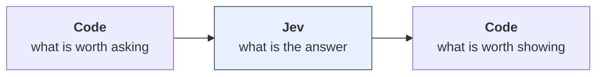
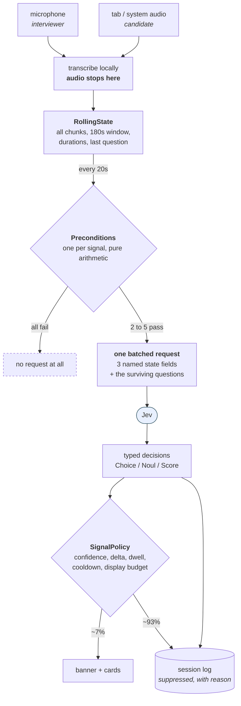
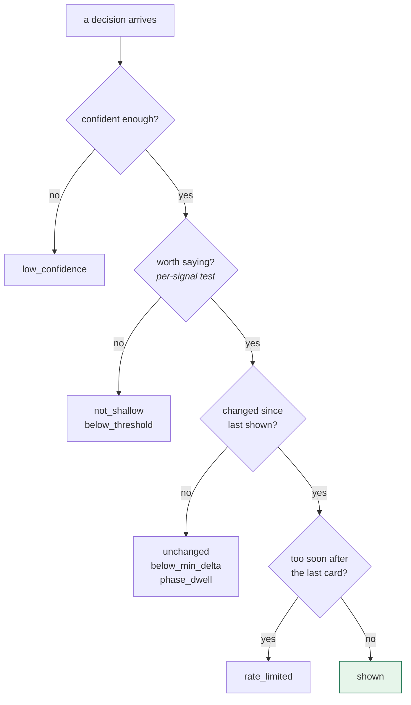
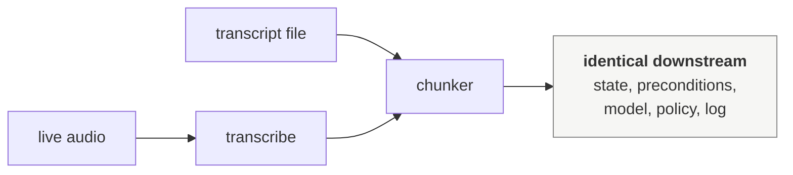

# Architecture

How a live transcript becomes a small number of typed judgments, and why most of
the engineering is about *not* calling the model.

## The claim

Wrapping a language model is commodity work. The interesting problem in a live
assistant is not getting an answer, it is deciding **which questions are worth
asking** and **which answers are worth a person's attention while they are busy**.

This system asks five fixed questions every twenty seconds. Measured on a real
ten-minute session:

| Measure | Session |
|---|---|
| Questions that could have been asked | 200 |
| Never sent, blocked by a precondition | **81** (40%) |
| Judgments actually made | 119 |
| Judgments shown to the interviewer | **8** (7%) |
| Cost | $0.0025, about $0.015 per interview-hour |
| Median latency per batched call | 119 ms |

That cost is a quarter of one cent. A hundred interview-hours would come to $1.51,
because the model bills input tokens only at $0.042 per million and output is free.
Cost is not what constrains this design; attention is.

So 40% of the work is avoided before any network call, and 93% of what comes back
is discarded. **The product is mostly the two filters, not the model in between.**

## The three-decision split



The model sits in the middle and only does the part that needs language
understanding. The decisions on either side are ordinary software, and they are
where the behaviour lives.

This split is deliberate. An evaluator that also decided what to display would
have no way to distinguish *"the model is wrong"* from *"the model is right and
this is a bad moment to interrupt."* Those need different fixes, so they are
different layers.

## The pipeline



Two things in that diagram matter more than they look.

**Suppressed decisions are still stored.** Every judgment is persisted with its
probability, confidence and the reason it was withheld. That is what makes the
93% measurable after the fact instead of invisible.

**Audio never leaves the machine.** Transcription is local, so only a bounded
window of text ever crosses a network boundary.

## Deciding what to ask

Each signal carries a `Precondition`, a plain function over state:

```python
Precondition = Callable[[RollingState], str | None]   # None = ask it
```

Return a string and the question is dropped from the batch, with that string kept
as the reason. Every one is arithmetic, because the model cannot count or compare
times reliably, so none of that logic is ever put in a prompt.

| Signal | Asked when | Skip reason |
|---|---|---|
| `current_phase` | past the first minute | `cold_start` |
| `answered_question` | last question is 20 to 120 seconds old | `no_recent_question`, `fair_chance_window` |
| `answer_depth` | same gate | same |
| `clarity` | ≥90s of candidate speech in window | `insufficient_candidate_speech` |
| `rambling_risk` | ≥45s uninterrupted candidate turn | `short_turn` |

Each encodes when a question is *answerable*, not when the answer would be
interesting. You cannot ramble in forty-five seconds. Clarity is a property of an
explanation, and under ninety seconds of speech there is no explanation to judge.
Twenty seconds after a question the candidate may still be drawing breath, and
judging before then punishes a pause.

## Building the request

Only three fields are sent, and one of them is precomputed:

```json
{
  "interview_type": "system_design",
  "latest_interviewer_question": "Why 301 versus 302?",
  "recent_transcript": [ {"speaker": "candidate", "text": "..."}, ... ]
}
```

Three constraints shaped that, each answering a documented model weakness:

**Resolve indirection in code.** Finding the last question and judging the answer
against it is two hops, and multi-hop reasoning degrades accuracy. Code walks the
transcript backwards and passes the question as a named field, leaving one
judgment against named inputs.

**Filter the state.** Irrelevant context is a distractor, so a 180-second window
goes rather than the session so far.

**Keep arithmetic out.** Every duration in the system is computed in Python and
used to decide *whether to ask*. None of it is ever asked as a question.

All surviving questions then go in **one request over shared state**. They are
scored independently and cannot see each other's answers, so batching changes no
answer. It just stops the window being re-sent once per signal.

## The questions are artifacts, not configuration

The five questions are Python constants. Nothing generates them and nothing varies
them; every tick sends identical wording and only the transcript underneath moves.

They are deliberately not config. Every stored decision is stamped with
`signal_version`, which is what lets a replay from weeks ago be compared to one
from today, and that guarantee holds only while version and wording move together.
A SHA-256 over the question text, the precondition thresholds and the window size
is pinned in a test:

```
AssertionError: The wording sent to Jev changed while signal_version stayed v0.3.
Bump SIGNAL_SET_VERSION, then set EXPECTED_FINGERPRINT to e37c084f88225eeb.
```

The thresholds are in there because moving a gate changes which ticks produce a
judgment at all, which alters the collected data just as surely as a reword does.

## Deciding what to show



Four gates, each answering a different way a correct answer can be bad product
behaviour:

**Confidence.** A hedged judgment is not worth an interruption.

**Worth saying.** Signal-specific, and often asymmetric. For
`answered_question`, only a confident *no* earns a slot: a confident "they
answered it" is correct and tells the interviewer nothing they can act on.

**Changed.** Phase labels flicker at boundaries, so a new label must hold for two
consecutive ticks before it replaces the displayed one. Scores must move by a
minimum delta.

**Rate.** A card every few seconds is noise regardless of how right each one is.

The reasons are real, from stored data across recorded sessions:
`low_confidence`, `below_min_delta`, `rate_limited`, `unchanged`,
`not_confident_negative`, `not_shallow`, `phase_dwell`.

## Two kinds of output

Not all signals interrupt, and the distinction turned out to matter:

| | Phase banner | Cards |
|---|---|---|
| Where it lives | header, always visible | appear and age out after 75s |
| Attention cost | near zero | an interruption |
| Evidence | holds up across sessions | unproven |

That split is why the usefulness gate tests only the cards. The banner is ambient
and already earns its place; the cards have to prove they are worth the
interruption, and if they fail the banner survives on its own.

## Replay

The same pipeline runs offline from a stored transcript, at any speed, against
either the real model or a keyword stand-in that needs no network or credentials.



The chunk is the seam. Everything after it is shared between live and replay,
untouched, which is what makes a recorded session re-runnable against a changed
signal set and comparable to the original.

## What this does not do

**No generated prose.** The model returns labels, probabilities and scores.
Nothing it produces is shown as text.

**Nothing candidate-facing.** Output is interviewer-only, by construction.

**No arithmetic in the model.** Timing, counting and duration comparison are code.

**No runtime question selection.** Five fixed questions, forever, until someone
edits them and bumps the version.
